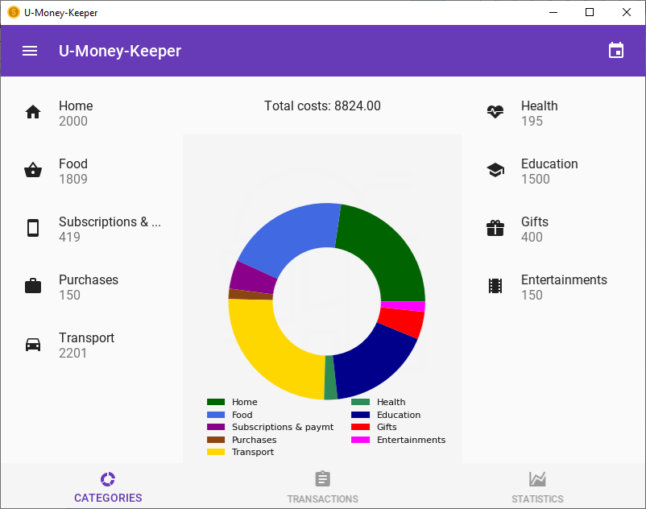
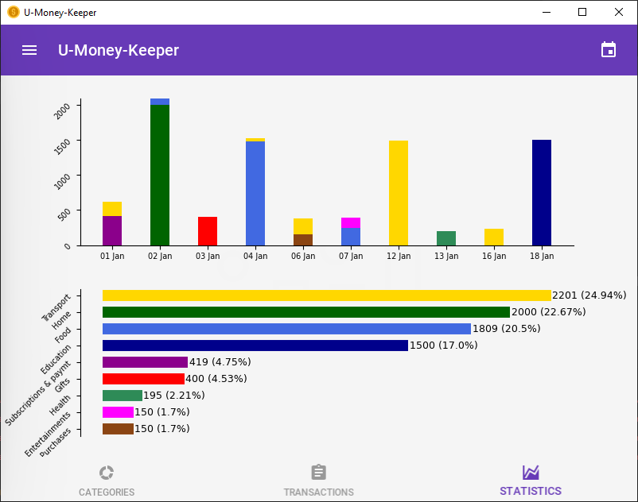
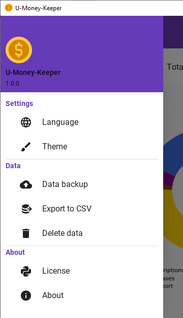
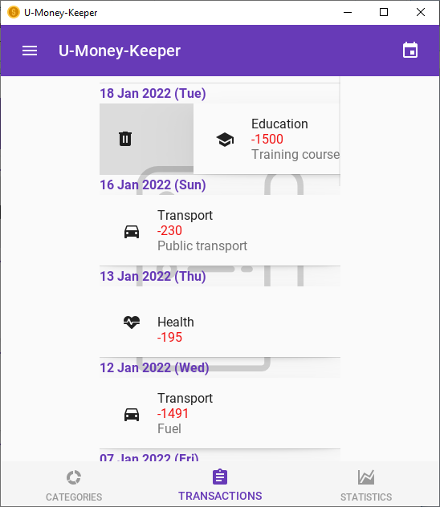

# U-Money-Keeper

The project of a simple application for keeping track of your daily expenses.

## App Screenshots
 

 

## Built With
* [Kivy Framework](https://github.com/kivy/kivy) - UI Elements
* [KivyMD Framework](https://github.com/kivymd/KivyMD) - Material Design UI Elements
* [SqLite](https://www.sqlite.org/index.html) - Local DB
* [sqlite3 python](https://docs.python.org/3/library/sqlite3.html) - Local DB API
* [Icons](https://www.flaticon.com/) - All app's icons
* [Charts](https://github.com/matplotlib/matplotlib) - All app's Charts

## Authors

* **Nikita** - [GitHub](https://github.com/nshtolvin)